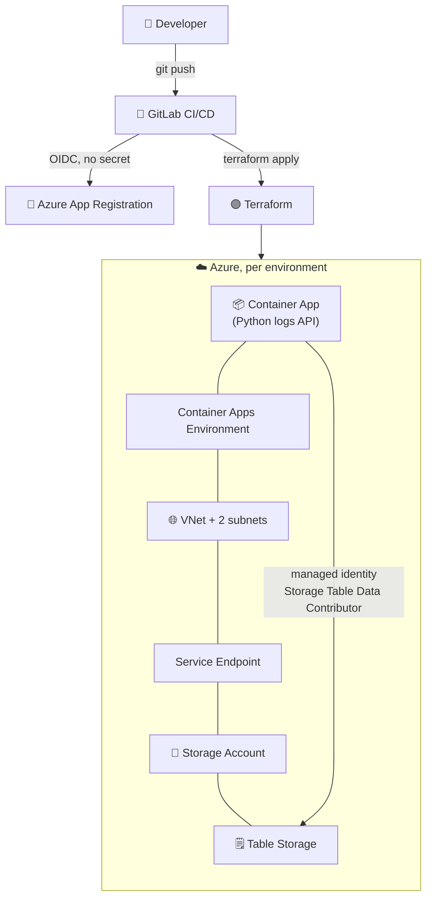
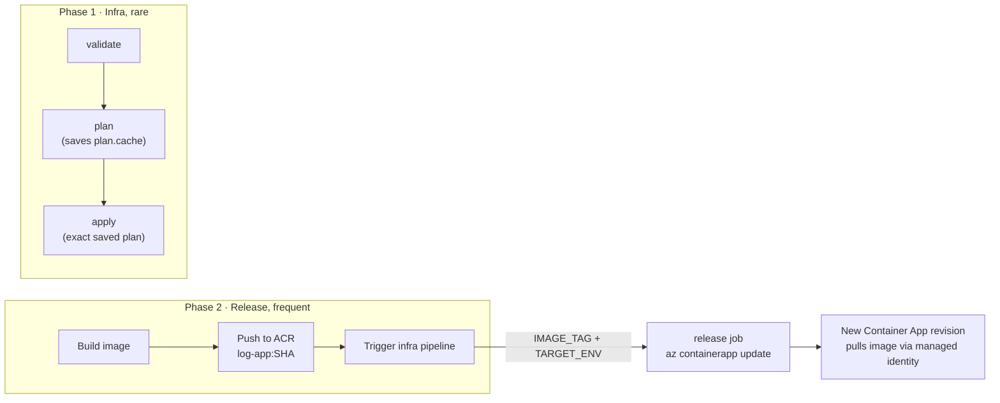

# 🐜 Street-Termites

### DevOps training project, Simplon, containerized logging API on Azure, fully deployed as code

Source of truth lives on **GitLab**. This repository is the public overview and entry point.

 

[**GitLab group ➜ street-termites**](https://gitlab.com/street-termites)

---

## 📌 What is this

As part of our DevOps training we built a **containerized web API that stores application logs in Azure Table Storage**, and we designed and deployed its entire cloud infrastructure on Microsoft Azure **as code**, with no manual step.

The project demonstrates a full DevOps chain:

- **Infrastructure as Code** with Terraform
- **Containerization** with Docker
- **CI/CD** with GitLab pipelines
- **Passwordless security** with OIDC, App Registration and least-privilege RBAC
- **Documentation** with ADRs, diagrams and cost estimation

---

## 📦 The three repositories

Everything is split across three GitLab repositories in the `street-termites` group. Click through:

| Repository | Role | Pipeline |
|---|---|---|
| 🐍 [**st-app-logs**](https://gitlab.com/street-termites/st-app-logs) | The logging web API (Python) |  |
| 🏗️ [**st-infra-deploy**](https://gitlab.com/street-termites/st-infra-deploy) | Terraform IaC + CI/CD pipelines |  |
| 📚 [**st-infra-docs**](https://gitlab.com/street-termites/st-infra-docs) | ADRs, architecture diagrams, conventions |  |

---

## 🏛️ Architecture

Full diagram and rationale in [`st-infra-docs/project.md`](https://gitlab.com/street-termites/st-infra-docs/-/blob/main/project.md).

---

## 🔁 How a change reaches production

Deployment is split into **two phases** with two cadences: infrastructure changes are rare, application releases are frequent.

| Branch | Environment | Apply |
|---|---|---|
| `develop` | Staging | automatic |
| `main` | Production | **manual gate**, always behind a human click |

Details in [`st-infra-docs/gitlab-cicd.md`](https://gitlab.com/street-termites/st-infra-docs/-/blob/main/gitlab-cicd.md).

---

## 🔐 Security highlights

<b>Click to expand the security model</b>

 

- **Protected `main`**: no direct push, every change goes through a reviewed Merge Request.
- **OIDC, no secret**: GitLab issues a short-lived JWT, Azure trusts it through a federated credential on the App Registration. No password or client secret is stored anywhere.
- **Least-privilege RBAC**: the CI service principal gets targeted per-service roles, never a global `Contributor`, and an **ABAC condition** prevents it from escalating its own privileges.
- **Network isolation**: the Storage Account is reached only through a VNet **Service Endpoint** from the dedicated subnet.
- **Pipeline scanning**: GitLab **SAST** and **Secret Detection** run on every pipeline.

Full write-ups:
[project-security.md](https://gitlab.com/street-termites/st-infra-docs/-/blob/main/project-security.md) ·
[iam-gitlab-ci.md](https://gitlab.com/street-termites/st-infra-docs/-/blob/main/iam-gitlab-ci.md)

---

## 🧭 Architecture Decision Records

<b>Why we chose what we chose</b>

 

| ADR | Decision |
|---|---|
| [ADR-0001](https://gitlab.com/street-termites/st-infra-docs/-/blob/main/docs/Azure/adr0001-compute-platform-for-api.md) | Azure Container Apps as the hosting platform for the API |
| [ADR-0002](https://gitlab.com/street-termites/st-infra-docs/-/blob/main/docs/Azure/adr0002-storage-backend-for-logs.md) | Azure Table Storage as the persistence backend for the logs |
| [ADR-0003](https://gitlab.com/street-termites/st-infra-docs/-/blob/main/docs/Azure/adr0003-app-registration-oidc-authentication.md) | GitLab to Azure authentication via OIDC + App Registration |

---

## 💶 Cost

Estimated at **~€2.19 / month** for two full environments (staging + production), low traffic, France Central region. Breakdown in [`cost-estimation.md`](https://gitlab.com/street-termites/st-infra-docs/-/blob/main/cost-estimation.md).

---

## 🛠️ Tech choices at a glance

| Component | Technology | Why |
|---|---|---|
| Hosting | Azure Container Apps | Serverless run of a container |
| Storage | Azure Table Storage | Simple, cheap store for logs |
| IaC | Terraform | Reproducible, automated |
| CI/CD | GitLab CI/CD | Automated test + deploy |
| Auth | App Registration + OIDC | Passwordless, no stored secret |
| Network | VNet + Service Endpoint | Isolation of the storage |

---

## 👥 Contributors

| Member | Role |
|---|---|
| **Melvin Petit** ([@WhiteMuush](https://github.com/WhiteMuush)) | Documentation, GitLab / Azure governance, project coordination |
| **Thomas Enjalbert** | Azure infrastructure and Infrastructure as Code |
| **Mohamed Saidi** | Logging API development |
| **Aïcha Elouadi** | Documentation, GitLab / Azure governance |

GitLab members: [street-termites group](https://gitlab.com/groups/street-termites/-/group_members).

---

Simplon DevOps training project · code hosted on <a href="https://gitlab.com/street-termites">GitLab</a>

